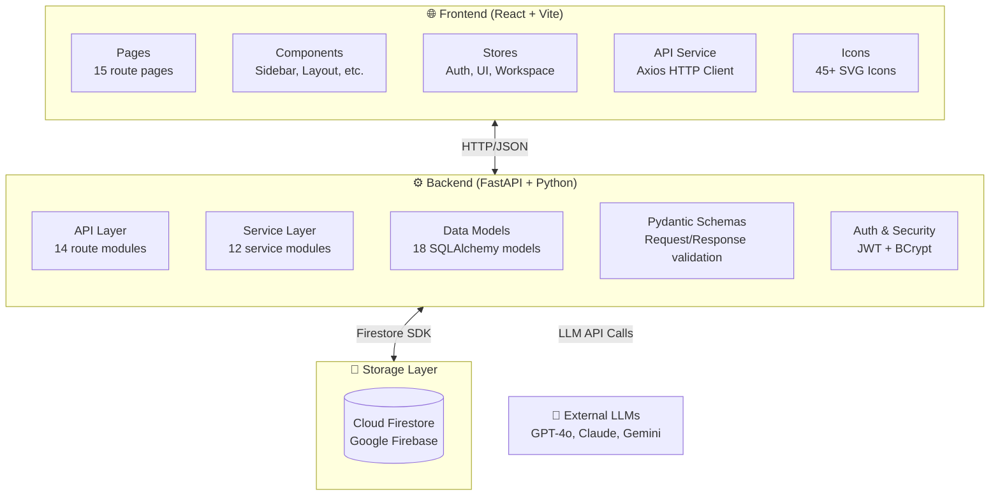
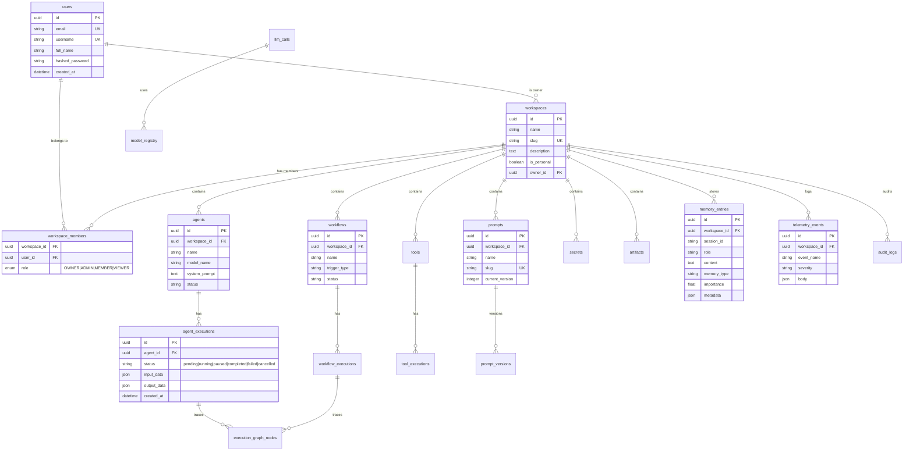
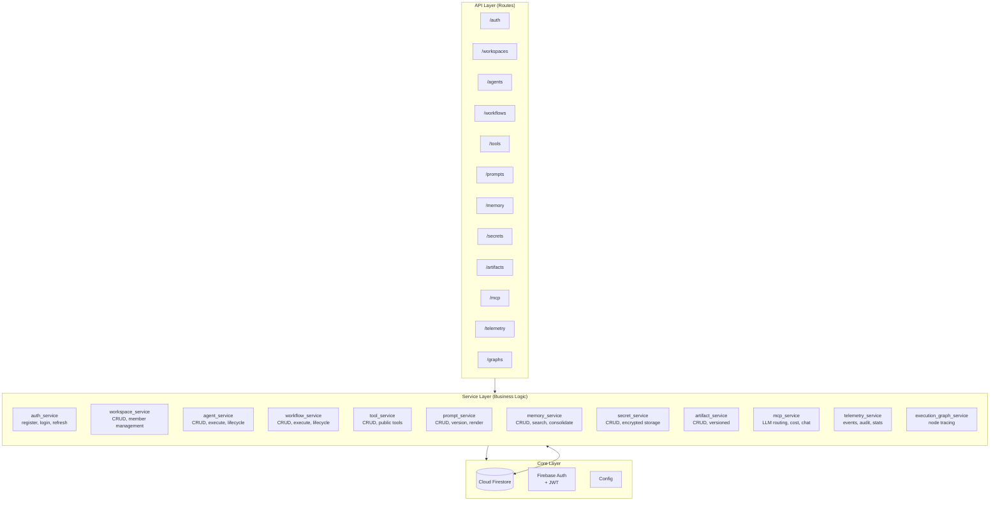
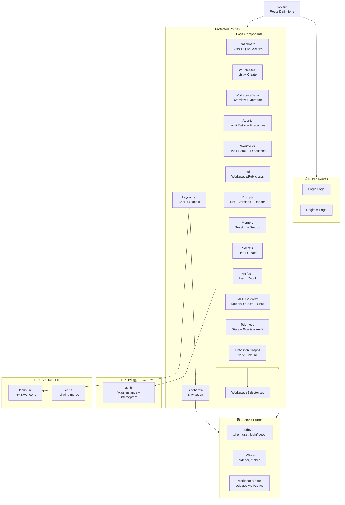
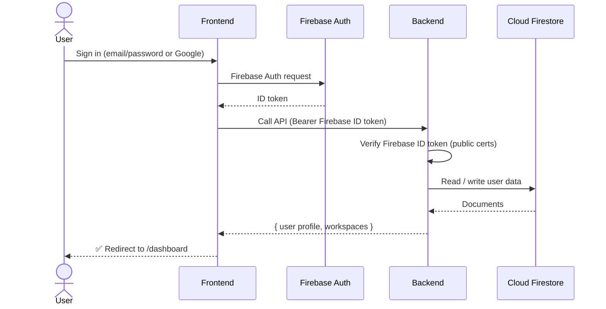
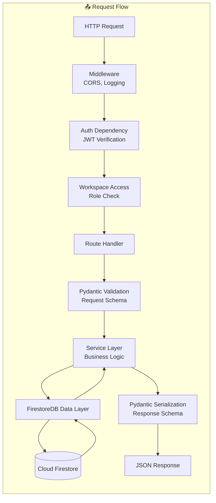
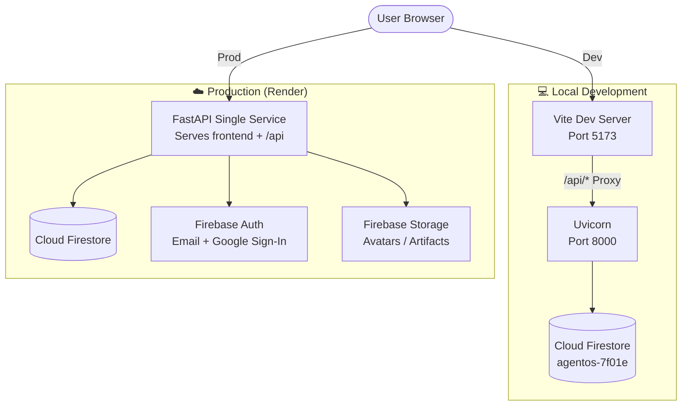
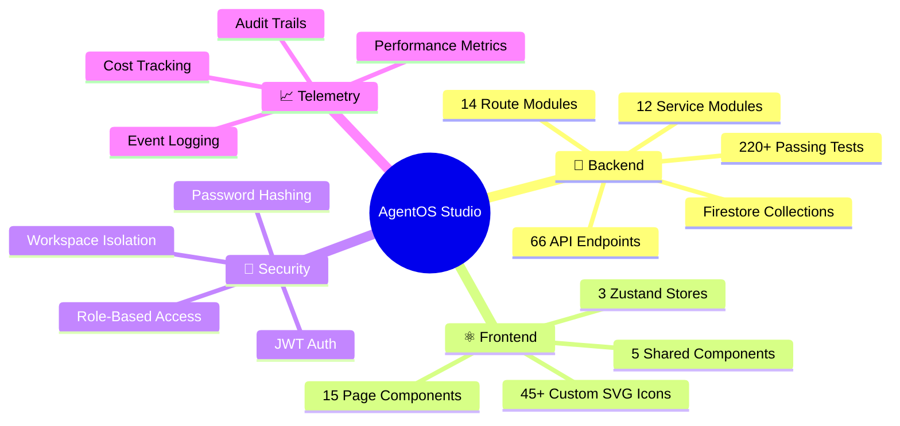

# 🏗️ AgentOS Studio — Architecture Guide

> **AgentOS Studio** is a full-stack AI agent orchestration platform that enables users to create, manage, and monitor AI agents, workflows, tools, prompts, and memory — all within isolated workspaces.

---

## 🔭 What It's Used For

AgentOS Studio is designed for:

| Purpose | Description |
|---------|-------------|
| **🤖 Agent Management** | Create and manage AI agents with configurable models, system prompts, and execution lifecycle (start/pause/resume/cancel) |
| **⚡ Workflow Automation** | Build sequential or approval-based workflows with manual/triggered execution |
| **🧠 Memory Systems** | Persistent session-based memory with search, consolidation, and importance scoring |
| **🔧 Tools Registry** | Register and version tool definitions (functions, APIs, code) with public/workspace visibility |
| **📝 Prompt Registry** | Version-controlled prompt templates with variable rendering and rollback support |
| **🔐 Secrets Manager** | Encrypted credential storage per workspace with environment scoping |
| **📦 Artifact Store** | Versioned binary/structured asset tracking with content type filtering |
| **🔌 MCP Gateway** | LLM model routing with cost tracking, usage analytics, and live chat completions |
| **📊 Telemetry & Audit** | Event logging, audit trails, cost dashboards, and duration analytics |
| **🔀 Execution Graphs** | Node-level execution tracing and debugging for agent/workflow runs |
| **👥 Workspace Isolation** | Multi-tenant workspaces with role-based access (Owner/Admin/Member/Viewer) |

---

## 🧩 High-Level Architecture



---

## 📂 Project Structure

```
agentos-studio/
├── backend/                          # Python FastAPI Backend
│   ├── app/
│   │   ├── api/                      # Route handlers (14 modules)
│   │   │   ├── __init__.py           # Router aggregation
│   │   │   ├── deps.py               # Dependency injection (auth, db)
│   │   │   ├── auth.py               # Auth routes (/auth/*)
│   │   │   ├── users.py              # User management
│   │   │   ├── workspaces.py         # Workspace CRUD + members
│   │   │   ├── agents.py             # Agent CRUD + execution lifecycle
│   │   │   ├── workflows.py          # Workflow CRUD + execution lifecycle
│   │   │   ├── tools.py              # Tool registry
│   │   │   ├── prompts.py            # Prompt registry + versioning
│   │   │   ├── memory.py             # Memory CRUD + search + consolidation
│   │   │   ├── secrets.py            # Secret storage
│   │   │   ├── artifacts.py          # Artifact registry
│   │   │   ├── mcp.py                # LLM routing + chat completions
│   │   │   ├── telemetry.py          # Events + audit logs
│   │   │   └── execution_graphs.py   # Execution node tracing
│   │   ├── core/                     # Core config
│   │   │   ├── config.py             # App settings
│   │   │   ├── database.py           # Firestore-backed data layer
│   │   │   └── security.py           # Firebase token verification
│   │   ├── models/                   # Enum definitions for schema compat
│   │   ├── schemas/                  # Pydantic request/response models
│   │   ├── services/                 # Business logic (12 modules)
│   │   └── main.py                   # FastAPI app factory
│   └── tests/                        # 220+ async tests
│
└── frontend/                         # React + TypeScript Frontend
    └── src/
        ├── components/               # Reusable UI components
        │   ├── Icons.tsx             # 45+ SVG icon system
        │   ├── Sidebar.tsx           # Navigation sidebar
        │   ├── Layout.tsx            # App layout wrapper
        │   ├── ProtectedRoute.tsx    # Auth guard
        │   └── WorkspaceSelector.tsx # Workspace dropdown
        ├── pages/                    # Route pages (15 pages)
        ├── services/
        │   └── api.ts                # Axios HTTP client
        ├── stores/                   # Zustand state management
        │   ├── authStore.ts          # Auth state + tokens
        │   ├── uiStore.ts            # Sidebar, theme state
        │   └── workspaceStore.ts     # Selected workspace
        └── utils/
            └── cn.ts                 # Tailwind class merging
```

---

## 🚏 API Route Map

```mermaid
graph LR
    subgraph Auth["🔐 Authentication /auth"]
        REG[POST /register]
        LOG[POST /login]
        REF[POST /refresh]
        ME[GET /me]
        LOT[POST /logout]
    end

    subgraph Users["👤 Users /users"]
        UL[GET /]
        UD[GET /{id}]
        UP[PATCH /{id}]
        UDEL[DELETE /{id}]
    end

    subgraph WS["📁 Workspaces /workspaces"]
        WL[GET /]
        WC[POST /]
        WGET[GET /{id}]
        WP[PATCH /{id}]
        WDEL[DELETE /{id}]
        WM[GET /{id}/members]
        WMA[POST /{id}/members]
        WMP[PATCH /{id}/members/{uid}]
        WMD[DELETE /{id}/members/{uid}]
    end

    subgraph Agents["🤖 Agents /workspaces/{wid}/agents"]
        AL[GET /]
        AC[POST /]
        AGET[GET /{id}]
        AP[PATCH /{id}]
        ADEL[DELETE /{id}]
        AEX[POST /{id}/execute]
        AEL[GET /{id}/executions]
        AEST[POST /{id}/executions/{eid}/start]
        AEPA[POST /.../{eid}/pause]
        AERE[POST /.../{eid}/resume]
        AECA[POST /.../{eid}/cancel]
    end

    subgraph Workflows["⚡ Workflows /workspaces/{wid}/workflows"]
        WL2[GET /, POST /]
        WGET2[GET /{id}, PATCH, DELETE]
        WEX[POST /{id}/execute]
        WEL[GET /{id}/executions]
        WSTART[POST /.../{eid}/start]
        WPAUSE[POST /.../{eid}/pause]
        WRESUME[POST /.../{eid}/resume]
        WCANCEL[POST /.../{eid}/cancel]
        WAPPROVE[POST /.../{eid}/approve]
    end

    subgraph Tools["🔧 Tools .../workspaces/{wid}/tools"]
        TL[GET /, POST /]
        TPUB[GET /tools/public]
        TGET[GET /tools/{id}]
        TPATCH[PATCH /tools/{id}]
        TDEL[DELETE /tools/{id}]
        TEXEC[GET /tools/{id}/executions]
    end

    subgraph Memory["🧠 Memory .../workspaces/{wid}/memory"]
        MCREATE[POST /sessions/{sid}]
        MGET[GET /sessions/{sid}]
        MDEL[DELETE /sessions/{sid}]
        MSEARCH[GET /search]
        MCONSOLIDATE[POST /consolidate]
        MSESSIONS[GET /sessions]
        MSESSIONDEL[DELETE /sessions/{sid}]
    end

    subgraph Prompts["📝 Prompts .../workspaces/{wid}/prompts"]
        PL[GET /, POST /]
        PPUB[GET /prompts/public]
        PGET[GET /prompts/{id}]
        PPATCH[PATCH /prompts/{id}]
        PDEL[DELETE /prompts/{id}]
        PVERSIONS[GET /prompts/{id}/versions]
        PCREATEVER[POST /prompts/{id}/versions]
        PRENDER[POST /prompts/{id}/render]
        PROLLBACK[POST /prompts/{id}/rollback/{v}]
    end

    subgraph Secrets["🔐 Secrets .../workspaces/{wid}/secrets"]
        SL[GET /, POST /]
        SGET[GET /{id}]
        SPATCH[PATCH /{id}]
        SDEL[DELETE /{id}]
    end

    subgraph Artifacts["📦 Artifacts .../workspaces/{wid}/artifacts"]
        ARL[GET /, POST /]
        ARGET[GET /{id}]
        ARPATCH[PATCH /{id}]
        ARDEL[DELETE /{id}]
    end

    subgraph MCP["🔌 MCP Gateway"]
        MCHAT[POST /mcp/chat/completions]
        MMODELS[GET /mcp/models]
        MSEED[POST /mcp/models/seed]
        MCOSTS[GET /mcp/costs]
        MCALLS[GET /mcp/calls]
    end

    subgraph Telemetry["📊 Telemetry .../workspaces/{wid}"]
        TEL[POST /events]
        TEGET[GET /events]
        TESTATS[GET /events/stats]
        TEGETID[GET /events/{id}]
        TAUDIT[GET /audit-logs]
    end

    subgraph Graphs["🔀 Execution Graphs .../workspaces/{wid}/executions/{eid}"]
        GG[GET /graph]
        GNODES[GET /graph/nodes]
        GNODE[GET /graph/nodes/{nid}]
    end
```

---

## 🗄️ Data Model Relationships

> These relationships are **conceptual** — everything is stored as Firestore documents/collections (no SQL tables, no migrations).



---

## 🔄 Service Layer Architecture



---

## 🖥️ Frontend Component Hierarchy



---

## 🔐 Authentication Flow



---

## ⚡ Execution Lifecycle

```mermaid
stateDiagram-v2
    [*] --> pending
    pending --> running: start
    running --> completed: success
    running --> failed: error
    running --> paused: pause
    running --> cancelled: cancel
    paused --> running: resume
    cancelled --> [*]
    completed --> [*]
    failed --> [*]

    note right of pending
        Created but not yet started
        Initial state for all executions
    end note

    note right of running
        Actively executing
        Can be paused or cancelled
    end note

    note right of paused
        Suspended execution
        Can be resumed to continue
    end note

    note right of awaiting_approval
        Workflow-specific state
        Requires manual approval to continue
    end note

    awaiting_approval --> running: approve
```

---

## 🔄 Request Data Flow



---

## 🚀 Deployment Architecture



---

## 🔑 Key Design Decisions

| Decision | Choice | Rationale |
|----------|--------|-----------|
| **Backend Framework** | FastAPI (async) | Native async, auto-docs, Pydantic integration, high performance |
| **ORM** | None | Data access via Firestore SDK — no ORM, no migrations |
| **Database** | Firebase Cloud Firestore | Serverless, realtime, zero-ops, never powers off |
| **Auth** | JWT (access + refresh tokens) | Stateless, scalable, industry standard |
| **Frontend Framework** | React 18 + Vite | Modern, fast HMR, excellent DX |
| **State Management** | Zustand | Minimal boilerplate, TypeScript-first, tiny bundle size |
| **API Client** | Axios + TanStack Query | Automatic caching, refetching, error handling |
| **Styling** | Tailwind CSS | Utility-first, consistent design, dark theme |
| **Password Hashing** | Firebase Auth | Managed auth — email/password + Google Sign-In |
| **Data Store** | Firestore SDK | Async, serverless, no cold starts |

---

## 📊 By The Numbers



---

> *This architecture document was generated from the live codebase. Update as the system evolves.*
